# VSD_bandgap_sky130

## CTAT Schematic

## CTAT Voltage vs temperature graph 

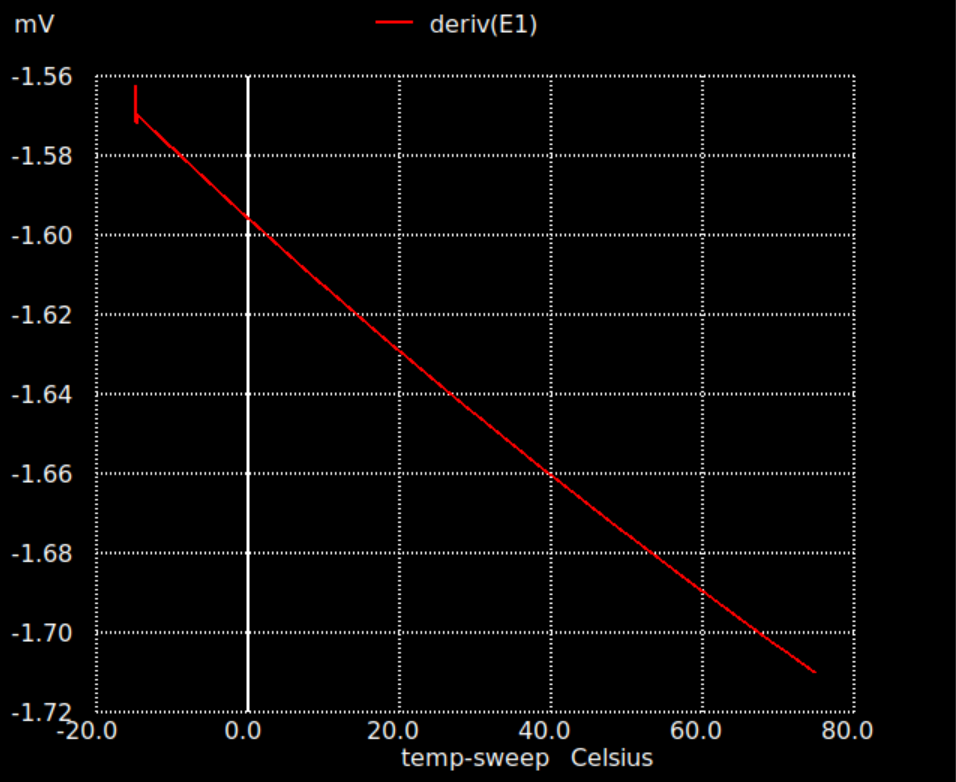

## CTAT Voltage vs supply graph

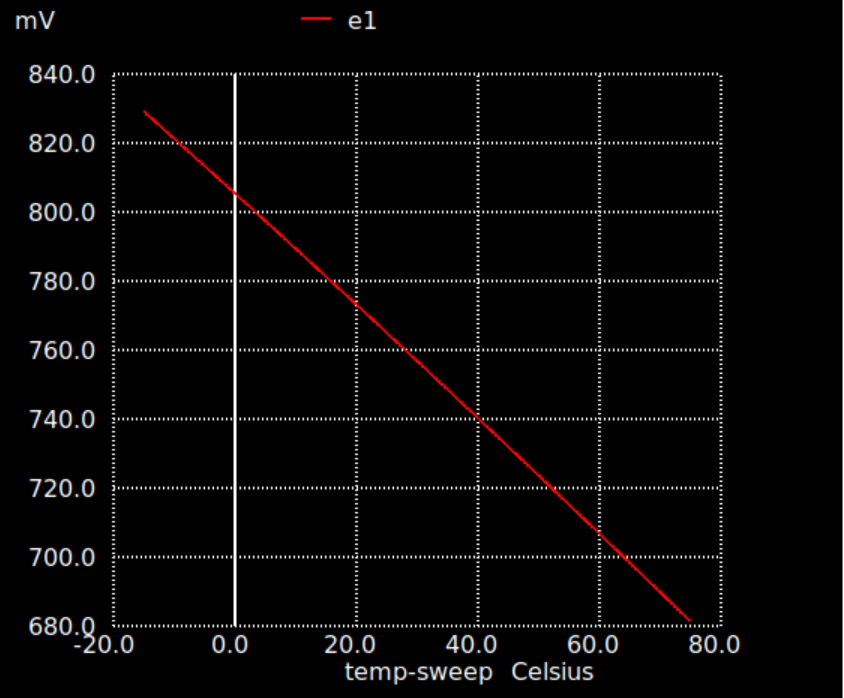

From these graphs the voltage across pnp transistor sky130_fd_pr__pnp_05v5_W3p40L3p40 was found to be 0.763 Volts at room temperature when 22uA cuurrent flows.
This value will be used in futher calculations

## PTAT Schematic

A Current mirror was constructed using Pfet_01v8 and Nfet_01v8 mosfets.Main objective of cuurent mirror is to equalise both branches current with amximum supply rejection ratio.
PTAT schematic includes a current mirror with one ppnp transitor on branch end and 8 transistors on other branch end.This finally leads to having PTAT voltage across resistor R1.

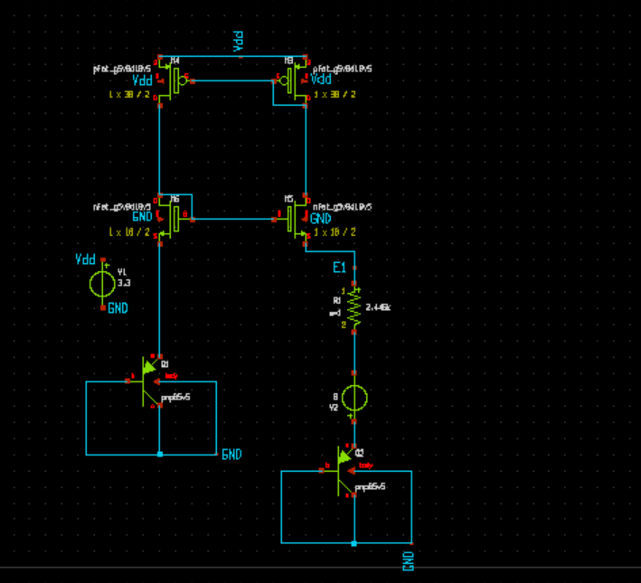

## Operating point voltages and current at PTAT schematic
As per specifications of bandgap we required 22uA cuurent,so calculated R1 resistor of 2264 ohm.v2#branch current is the branch current which is almost equal to 22uA.

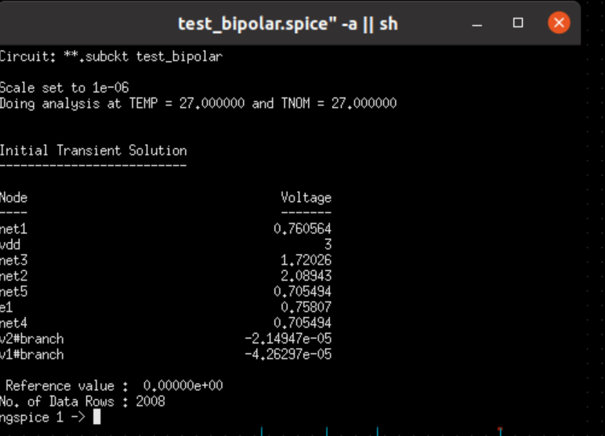

## PTAT and CTAT voltages temperature sweep at the PTAT schematic

Here we can see the temperature coefficient of CTAT is lot higher than and PTAT voltage so there is larger slope in CTAT .

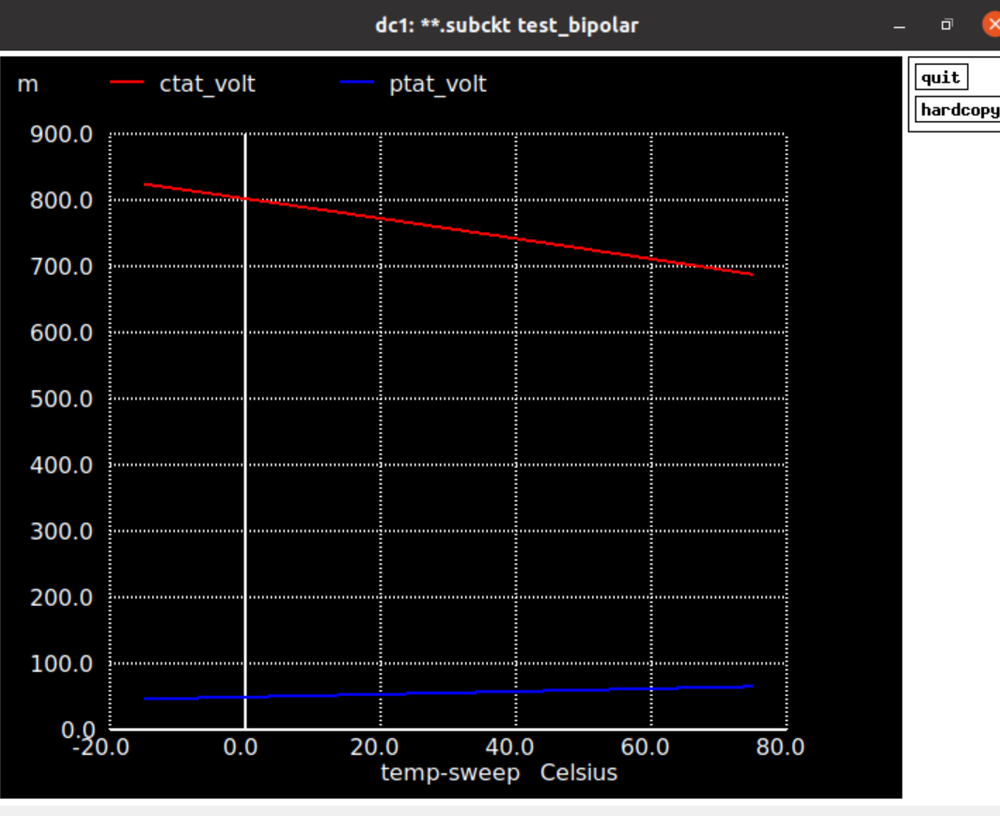

## Final Schematic with Resistor R2 to get 1.2 V at output ,Load resistor R3 (100Kohm) with a PNP transistor and Start up circuit.

Here resistor R2 increases temperature coefficient of PTAT and so that it becomes almost equal to CTAT and the addition results around 1.2 V.
R2 is found to be around 22k ohm to get 1.2 volt at output.

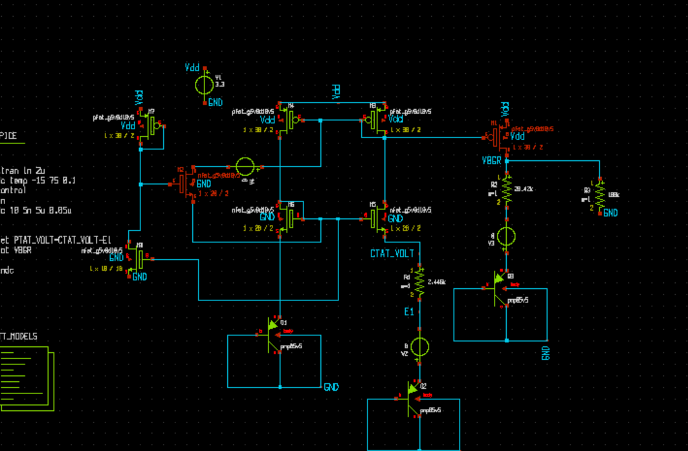

## temperature sweep of PTAT ,CTAT and VBGR in final schematic

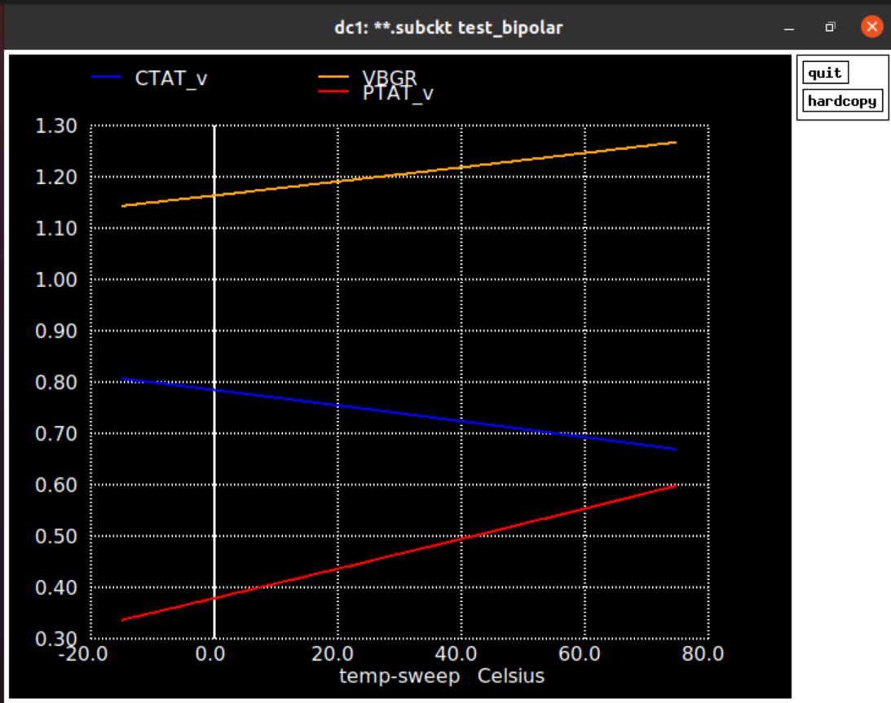

## temerature sweep of VBGR

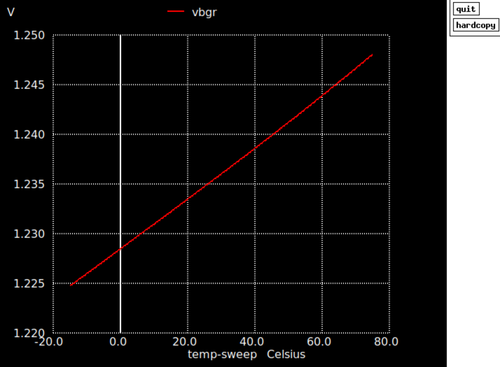

## voltage sweep of VBGR

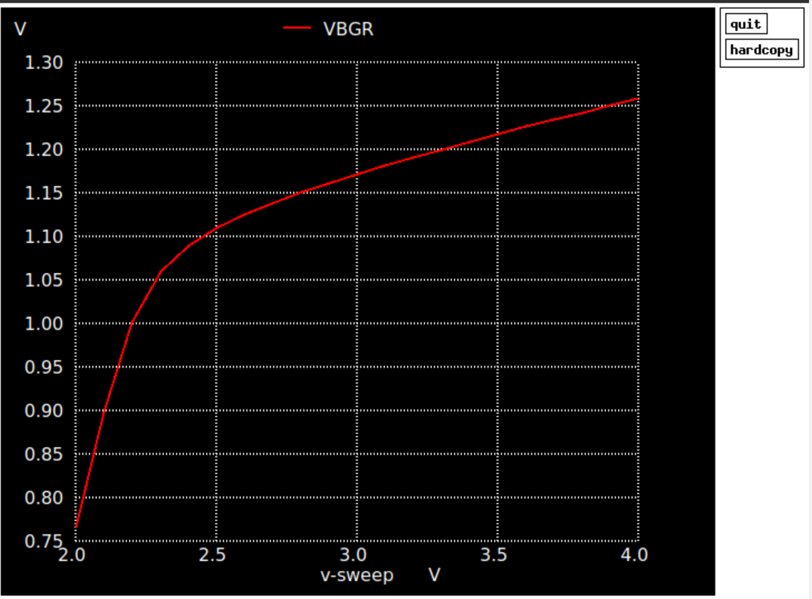

## temperature coefficint vs temperature

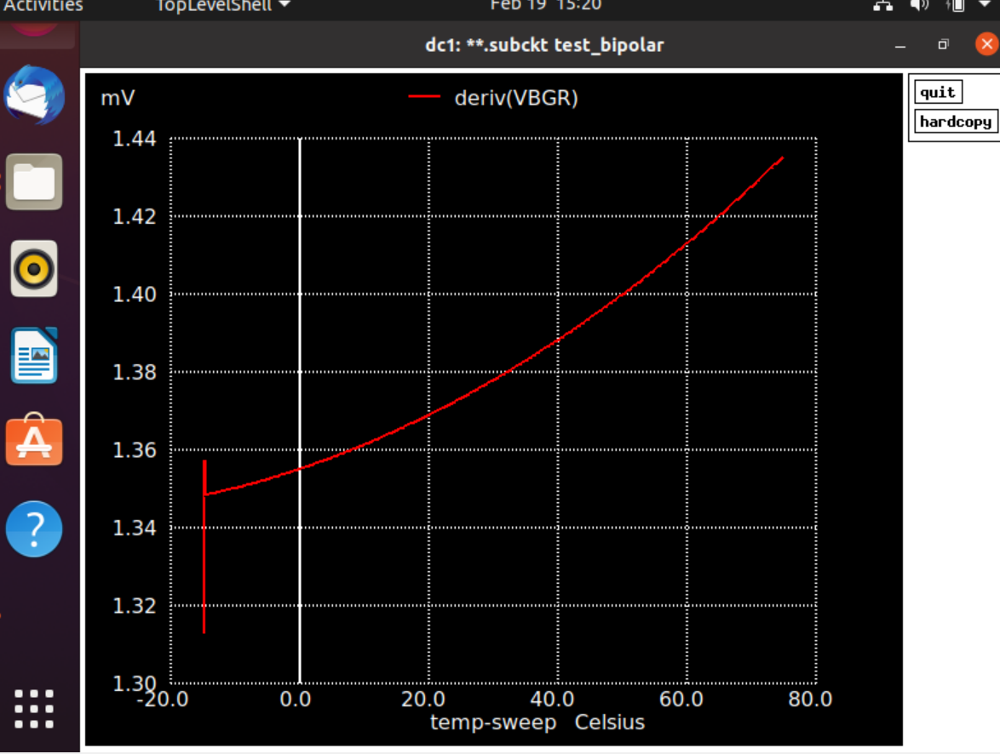

## Voltage coefficient vs Voltage

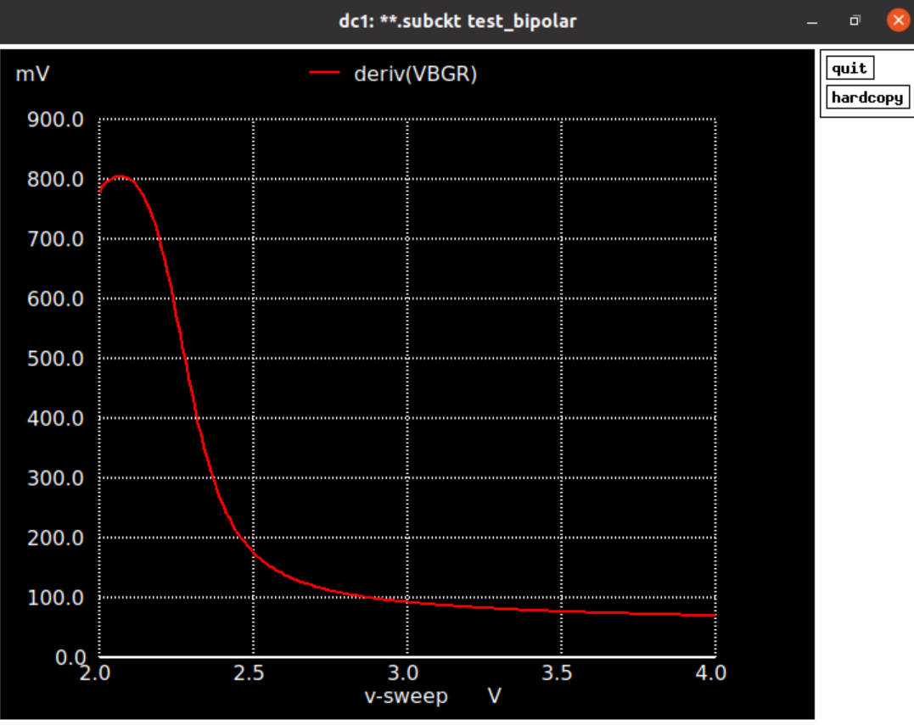

## Start up current 

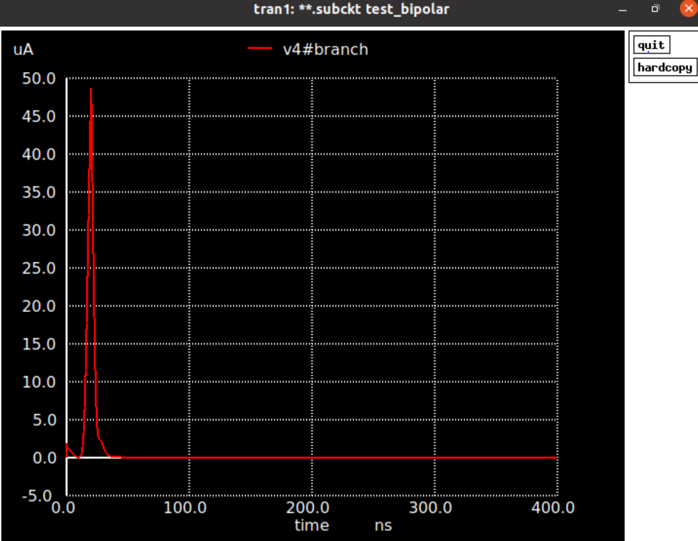

## Work Remaining

Have to resize transistors as the temperature and voltage coefficient of VBGR are not very small./
Have to Include Enable circuit./
Have To try cascoded mirror to make VBGR to be constant across all PVT corners/
Also Inlcude a trimming resistor for dealing with process variations.

